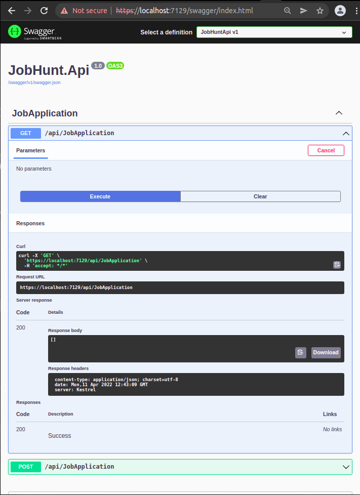
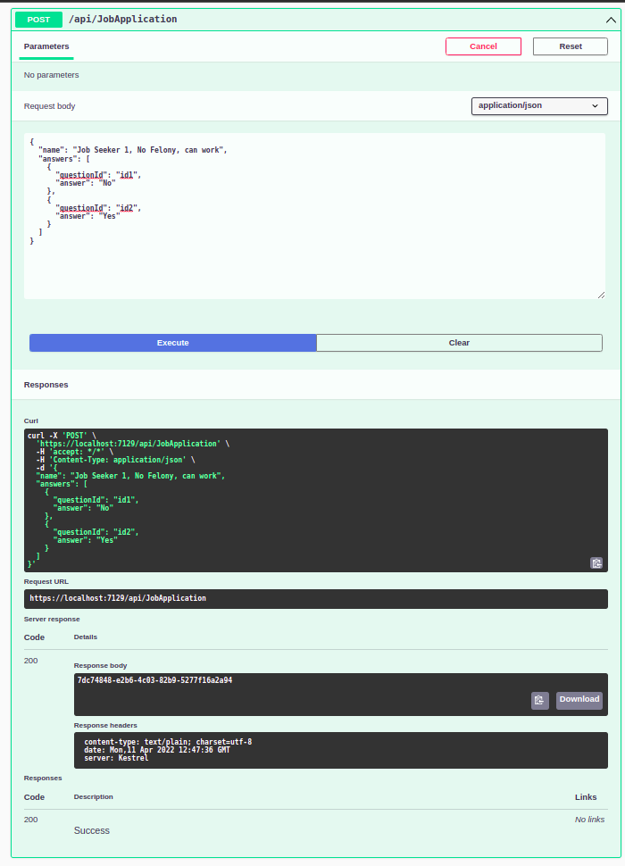
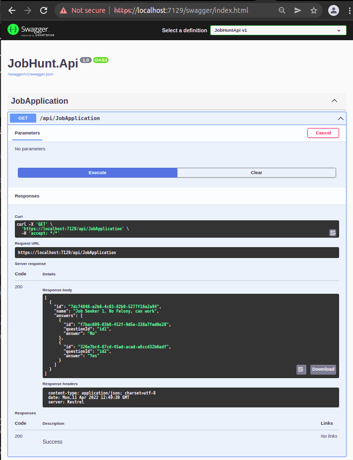
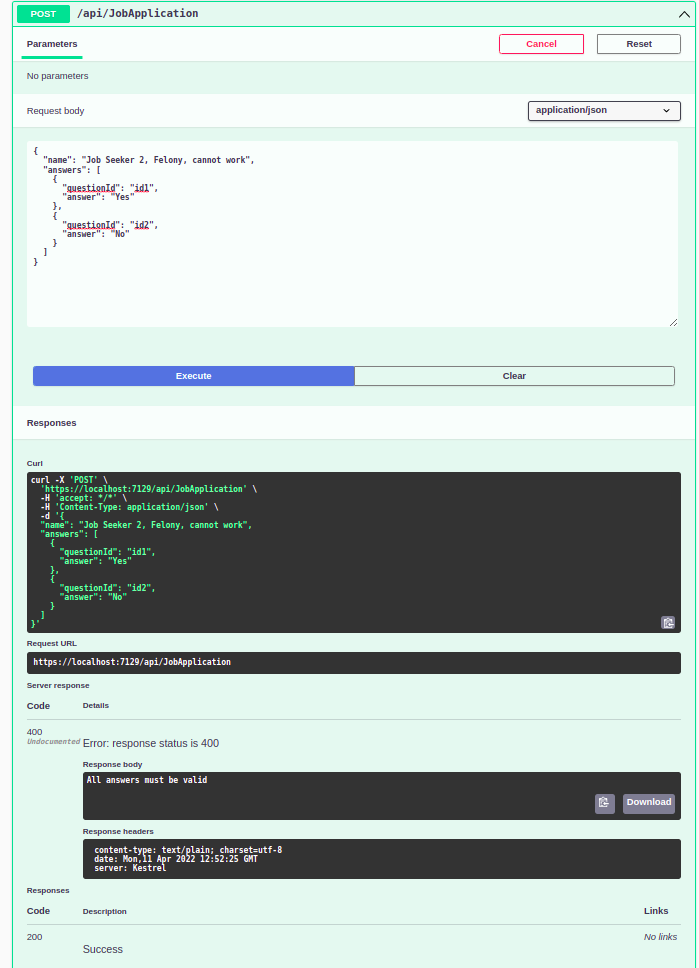
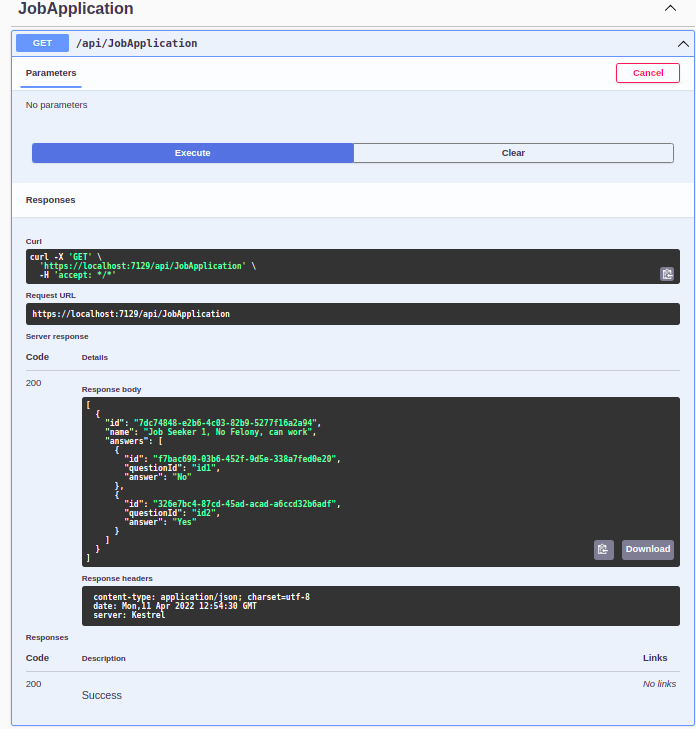
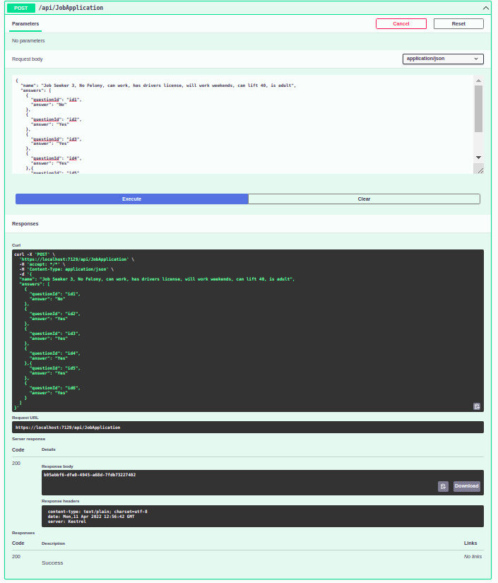
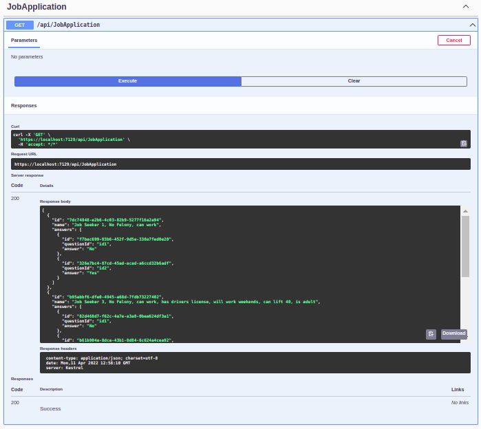
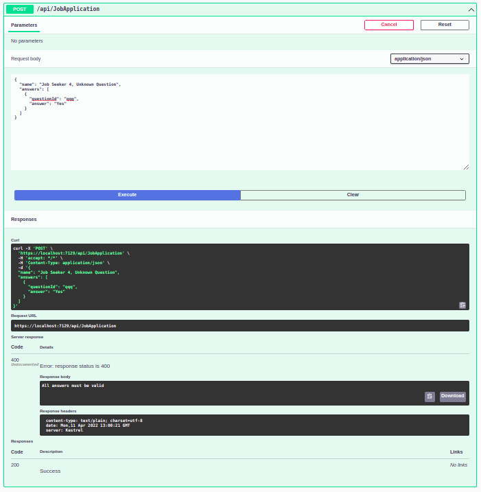
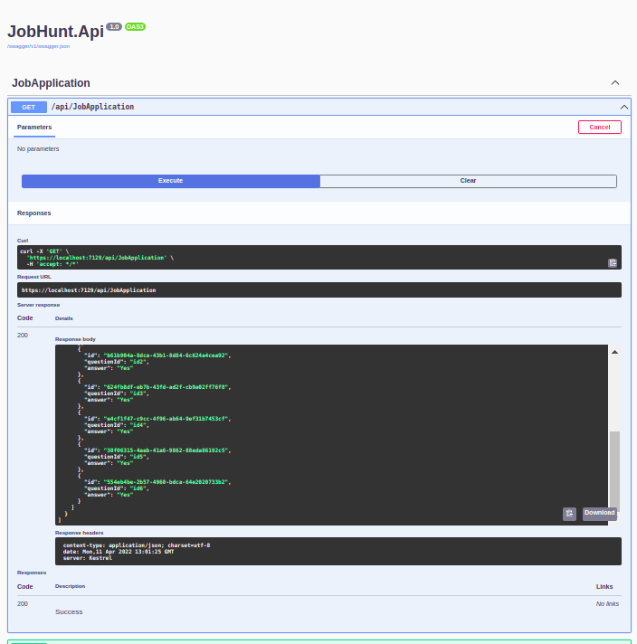

# Step 4 - Testing

Perform testing with the Swagger API UI.

1. Start the project locally with `dotnet run`
2. Observe the startup window for the URL and port number
3. Open the link for the URl and port, and append `/swagger/index.html` 
   - e.g. `https://localhost:7129/swagger/index.html`


Example: Get with Empty DB

[](00-swagger-get-empty-result.png)

## View Applications

At any point, you can view the list of *Accepted* JobApplications by:

- Expand the Get `/api/JobApplication` section
- Click **Try it out**
- Click **Execute**

Observe the list of records in the database.

[](00-swagger-get-empty-result.png)


## Test Submission #1 - Valid Data

Expand the Post `/api/JobApplication` section, and submit the following JSON:

```JSON
{
  "name": "Job Seeker 1, No Felony, can work",
  "answers": [
    {
      "questionId": "id1",
      "answer": "No"
    },
    {
      "questionId": "id2",
      "answer": "Yes"
    }
  ]
}
```

Observe that:
  - HTTP response code is 200 
  - Response body contains the new GUID value for the created record.

[](01a-swagger-post-test-1-valid-data.png)
[](01b-swagger-get-after-test-1.png)

## Test Submission #2 - Bad Data

Expand the Post `/api/JobApplication` section, and submit the following JSON:

```JSON
{
  "name": "Job Seeker 2, Felony, cannot work",
  "answers": [
    {
      "questionId": "id1",
      "answer": "Yes"
    },
    {
      "questionId": "id2",
      "answer": "No"
    }
  ]
}
```

Observe that:
  - HTTP response code is 400 
  - Response body contains *"All answers must be valid"*.

[](02a-swagger-post-test-2-bad-data.png)
[](02b-swagger-get-after-test-2.png)

## Test Submission #3 - Valid Data

Expand the Post `/api/JobApplication` section, and submit the following JSON:

```JSON
{
  "name": "Job Seeker 3, No Felony, can work, has drivers license, will work weekends, can lift 40, is adult",
  "answers": [
    {
      "questionId": "id1",
      "answer": "No"
    },
    {
      "questionId": "id2",
      "answer": "Yes"
    },
    {
      "questionId": "id3",
      "answer": "Yes"
    },
    {
      "questionId": "id4",
      "answer": "Yes"
    },{
      "questionId": "id5",
      "answer": "Yes"
    },
    {
      "questionId": "id6",
      "answer": "Yes"
    }
  ]
}
```
Observe that:
  - HTTP response code is 200 
  - Response body contains the new GUID value for the created record.

[](03a-swagger-post-test-3-valid-data.png)
[](03b-swagger-get-after-test-3.png)


## Test Submission #4 - Unknown Question Id

Expand the Post `/api/JobApplication` section, and submit the following JSON:
```JSON
{
  "name": "Job Seeker 4, Unknown Question",
  "answers": [
    {
      "questionId": "qqq",
      "answer": "Yes"
    }
  ]
}
```

Observe that:
  - HTTP response code is 400 
  - Response body contains *"All answers must be valid"*.
  
[](04a-swagger-post-test-4-unknown-question.png)
[](04b-swagger-get-after-test-4.png)


## Static Questions

The list of questions the system knows about are hard-coded in the **QuestionService** class.  
Here is a summary for reference during manual testing:

```C#
private readonly List<Question> _questions = new List<Question>()
{
    new Question()
    {
        Id = "id1",
        Text = "Have you ever been convicted of a felony?",
        Answer = "No"
    },
    new Question()
    {
        Id = "id2",
        Text = "Are you authorized to work in the United States?",
        Answer = "Yes"
    },
    new Question()
    {
        Id = "id3",
        Text = "Do you have a valid drivers license?",
        Answer = "Yes"
    },
    new Question()
    {
        Id = "id4",
        Text = "Are you available to work weekends?",
        Answer = "Yes"
    },
    new Question()
    {
        Id = "id5",
        Text = "Are you able to lift 40 pounds?",
        Answer = "Yes"
    },
    new Question()
    {
        Id = "id6",
        Text = "Are you at least 18 years of age?",
        Answer = "Yes"
    },
};
```